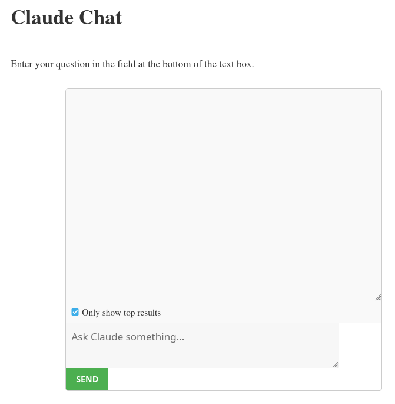
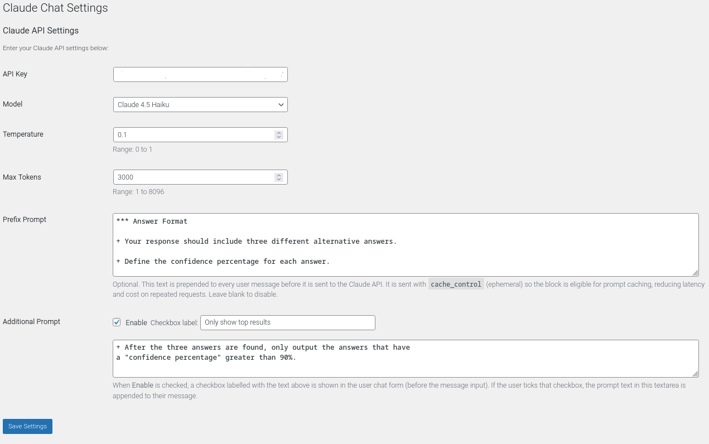

# Claude Chat Interface (WordPress Plugin)


Integrate the Claude AI chat interface into your WordPress website using a simple shortcode.


## Claude Models

### Claude 3 Family:
- **Claude 3 Haiku**: `claude-3-haiku-20240307`
- **Claude 3 Sonnet**: `claude-3-sonnet-20240229`
- **Claude 3 Opus**: `claude-3-opus-20240229`

### Claude 3.5 Family:
- **Claude 3.5 Sonnet**: `claude-3-5-sonnet-20240620`

## Features

- **Easy Integration**: Use a shortcode to seamlessly integrate the Claude AI chat interface into your WordPress site.
- **Admin Settings**: Configure API settings directly from the WordPress admin panel.
- **Customizable Interface**: Modify the chat interface appearance and behavior with ease.
- **Claude API Support**: Full support for Claude API parameters such as temperature, max tokens, and more.
- **AJAX-Based**: Smooth, responsive chat experience powered by AJAX.

## Installation

1. Upload the `claude-chat-interface` folder to the `/wp-content/plugins/` directory.
2. Activate the plugin through the 'Plugins' menu in WordPress.
3. Navigate to 'Settings' > 'Claude Chat' to configure your API settings.

## Usage

To display the chat interface on any page or post, use the shortcode:

```
[claude_chat]
```

## Configuration

Go to 'Settings' > 'Claude Chat' in the WordPress admin panel to configure the following options:

- **API Key**: Enter your Claude API key.
- **Model**: Select the Claude model you wish to use.
- **Temperature**: Adjust the randomness of responses (value between 0.0 and 1.0).
- **Max Tokens**: Set the maximum number of tokens for the response.
- **Prefix Prompt**: Optinal text can be added before the user's question.

## Customization

- **Styling**: Customize the chat interface by editing the `css/claude-chat.css` file.
- **JavaScript**: Add or modify functionality by editing the `js/claude-chat.js` file.

## Enhancements

### Added setting: Prefix Prompt

Registered in claude_chat_register_settings() with
sanitize_textarea_field as its sanitize callback (multi-line safe).

Added at the bottom of the settings form via
`claude_chat_settings_init().` It uses
`claude_chat_textarea_field_callback()` that renders a &lt;textarea>
(6 rows × 60 cols) with a description explaining the caching
behaviour. Leaving it blank disables the feature entirely.

**prefix + cache_control** - `claude_chat_api_request()`

When a prefix is saved, the user message is sent as a two-block
content array instead of a plain string.

The cache_control: ephemeral block tells Anthropic's API to cache the
prefix across repeated requests — reducing latency and token cost for
long system-style prompts. The anthropic-beta:
prompt-caching-2024-07-31 header is added automatically to enable this
feature.

**response cleanup** - `claude_chat_strip_prefix()`

After the API reply is received, this helper checks
(case-insensitively) whether the response begins with the prefix text
and strips it if so. Claude won't normally echo the prefix back, but
this guards against edge cases where it does.

### Minor improvements

Added newer models to `CLAUDE_MODELS` (Claude 3.5 Haiku, Claude 3.5
Sonnet Oct 2024, Claude 3.7 Sonnet).

Fixed temperature to only be sent when it's actually set (previously 0
would be silently dropped).

Bumped Max Tokens ceiling to 8096 to match modern model limits.

### js or css changes?

No changes.

js/claude-chat.js — The JavaScript only handles the chat UI: capturing
the user's input, sending it to admin-ajax.php via AJAX, and
displaying the response. None of that flow changed. The prefix prompt is
added (and stripped) entirely on the PHP/server side, invisibly to the
JS layer.

css/claude-chat.css — The new Prefix Prompt field in the admin
settings form uses standard WordPress admin classes (large-text, code,
description) that are already styled by WordPress core. No custom CSS
is needed.

## Requirements

- **WordPress**: Version 5.0 or higher.
- **PHP**: Version 7.0 or higher.
- **Claude API Key**: A valid Claude API key is required.


### Screenshots
#### Public View

#### Settings


## Support

For support, feature requests, or to report issues, please open an issue on the GitHub repository.

## License

This plugin is licensed under the DBAD License.

## Copyright

**Volkan Sah**

## Note on upsream repository

The repository
[(VolkanSah/WP-Claude-Interface)][https://github.com/VolkanSah/WP-Claude-Interface]
is archived. Most people just want a ready-made product and don't want
to learn from boilerplates — that's fine, but it's not what this was
built for.

If you need a real AI client for WordPress with full power behind it,
check out [WP AI Hub](https://github.com/VolkanSah/WP-AI-HUB) — a thin
client for [Multi-LLM API
Gateway](https://github.com/VolkanSah/Multi-LLM-API-Gateway).

Why? Because with one hub on HuggingFace Spaces you can pull Claude
via API into WordPress, route DeepSeek through OpenRouter, run Flux or
Veo 3 for image/video generation — all at the same time, all through
one connection. Not 20 different plugins to maintain, no annoying
premium limits per plugin, no bloat. Just one hub, all your models,
one WordPress client.

Deploy your own hub, connect it via WP AI Hub — and actually own your
AI stack.
